# SleuthBench

```mermaid
flowchart LR
    base["Stage 0<br/>Prepared public base table<br/>+ column summary"]
    inject["Stage 1<br/>Match compatible template<br/>and inject phenomenon"]
    validate["Stage 2<br/>Separate validator<br/>checks criterion"]
    compute["Stage 3<br/>Compute reference answer<br/>for edited table + question"]
    evaluate["Stage 4<br/>Evaluate model<br/>on each question"]
    grade["Stage 5<br/>Grade model response"]

    base --> inject --> validate --> compute --> evaluate --> grade

    classDef baseStyle fill:#e8e8e8,stroke:#666,color:#111
    classDef injectStyle fill:#f4b183,stroke:#9e480e,color:#111
    classDef validateStyle fill:#a9d18e,stroke:#548235,color:#111
    classDef computeStyle fill:#c9b1e8,stroke:#7030a0,color:#111
    classDef evalStyle fill:#9dc3e6,stroke:#2f75b5,color:#111

    class base baseStyle
    class inject injectStyle
    class validate validateStyle
    class compute computeStyle
    class evaluate,grade evalStyle
```



SleuthBench generates reproducible question-answer benchmarks for tabular data
analysis. It injects known statistical phenomena into datasets, validates that
each injected signal is unambiguous, computes ground-truth answers, evaluates
LLMs, and grades their responses.

## Requirements

- Python 3.11 or 3.12 (`.python-version` pins 3.11 for local development)
- [`uv`](https://docs.astral.sh/uv/) for Python and dependency management
- Provider credentials when running model evaluation; any grading run currently
  requires `OPENAI_API_KEY`

Install `uv` once if needed:

```bash
# macOS/Linux
curl -LsSf https://astral.sh/uv/install.sh | sh
```

```powershell
# Windows PowerShell
powershell -ExecutionPolicy ByPass -c "irm https://astral.sh/uv/install.ps1 | iex"
```

Then set up the repository:

```bash
uv sync
cp .env.example .env
```

Fill in only the credentials required by the providers you plan to use.

## Quick start

The tracked smoke configuration runs Stages 1-3 without making API calls:

```bash
uv run python src/run_experiment.py experiments/smoke.yaml
```

To configure a complete experiment:

```bash
cp experiments/example.yaml experiments/my_run.yaml
# Edit dataset, models, tools, and skip flags.
uv run python src/run_experiment.py experiments/my_run.yaml
```

Use `--force` to re-run validation for the selected instances:

```bash
uv run python src/run_experiment.py experiments/my_run.yaml --force
```

## Stage 0: data preparation

A fresh clone contains prepared base tables, standardized row-count variants,
and column summaries. To rebuild all tracked variants:

```bash
uv run python scripts/standardize_csvs.py --sizes 100 500 1000 10000
uv run python scripts/make_summaries.py --rewrite
```

Dataset sources, licenses, and preparation steps are documented in
[`data/DATASETS.md`](data/DATASETS.md).

## Stage 1: template matching and phenomenon injection

`src/phenomena_pipeline.py` matches templates to dataset summaries, resolves
slot values, and writes one modified table plus a manifest for each injected
phenomenon. Answers remain null until Stage 3.

```bash
uv run python src/phenomena_pipeline.py --seed 42
uv run python src/phenomena_pipeline.py \
  --summary data/standardized/summaries/bike_sharing_100.json \
  --template fc_nonmonotone_peak_v0
```

With a `run_id`, instances are isolated under
`data/instances/runs/<run_id>/<dataset>/seed_<N>/`.

## Stage 2: validation

`src/validate_pipeline.py` analytically checks that the injected phenomenon is
detectable and is the unambiguous answer to its question. Failed or unvalidated
instances do not proceed to evaluation.

```bash
uv run python src/validate_pipeline.py
uv run python src/validate_pipeline.py --dataset bike_sharing_100 --force
```

## Stage 3: answer computation

`src/answer_pipeline.py` computes ground truth from the modified table and the
injection metadata recorded in each passed manifest.


```bash
uv run python src/answer_pipeline.py
```

## Stage 4: model evaluation

`src/eval_pipeline.py` evaluates every selected question/model pair. `--models`
is required; there is no default model that can accidentally incur cost.

```bash
uv run python src/eval_pipeline.py \
  --models gpt-4o-mini \
  --table-in-prompt \
  --output data/results/eval_results_gpt-4o-mini.json

uv run python src/eval_pipeline.py \
  --models gpt-4o-mini \
  --dataset bike_sharing_100 \
  --tools run_python
```

The supported tools are:

- `load_data`: return the instance CSV to the model on request
- `run_python`: run model-authored Python against a preloaded `df`

Prompt-data precedence is `load_data` > `--columns-only` >
`--table-in-prompt` > question-only. The optional
`--injection-delay-seconds` setting pauses between instance manifests, which is
useful when provider rate limits require coarse throttling.

Evaluation checkpoints progress to `*.json.partial` and publishes the final
JSON atomically only after the complete batch succeeds.


## Stage 5: grading

`src/grade_pipeline.py` marks responses `CORRECT`, `PARTIAL`, or `INCORRECT`.
Canonical unambiguous numeric and leading `column_value` answers use a 5%
relative tolerance. Ambiguous or free-form responses use the configured OpenAI
judge.

The current implementation requires `OPENAI_API_KEY` before processing, even
when every entry in a grading batch can be graded deterministically.

```bash
uv run python src/grade_pipeline.py \
  --input data/results/eval_results_gpt-4o-mini.json
```

## Experiment configuration

`src/run_experiment.py` runs Stages 1-5 from one YAML file. See
[`experiments/example.yaml`](experiments/example.yaml) for a complete
configuration example.
The main controls are:

- `name`, `run_id`, `seed`, and `question_type` (`ds` or `business`)
- exactly one of `summary` or `summaries_dir`
- optional template, dataset, and injector filters
- top-level model defaults plus one or more named `runs`
- per-run `tools`, limited to `load_data` and `run_python`
- `skip_phenomena`, `skip_validate`, `skip_answer`, `skip_eval`, and
  `skip_grade`

A fresh Stage 1 run cannot skip validation or answer computation and then
continue to evaluation, because its new manifests do not contain those
prerequisites. In the combined runner, grading consumes only evaluation output
created by the same invocation. Use `grade_pipeline.py` directly to re-grade a
previous result.

Names and run IDs must be portable single path components. They are
Unicode-normalized and checked for case-insensitive collisions before output is
written.

## Manual questions

`src/manual_pipeline.py` creates an already-validated instance from a user CSV
and hand-authored QA pairs, bypassing Stages 1-3:

```bash
uv run python src/manual_pipeline.py manual/example.yaml
uv run python src/eval_pipeline.py \
  --models gpt-4o-mini \
  --dataset bike_sharing_100_manual \
  --injector manual \
  --tools run_python \
  --output data/results/eval_results_bike_sharing_100_manual_gpt-4o-mini.json
uv run python src/grade_pipeline.py \
  --input data/results/eval_results_bike_sharing_100_manual_gpt-4o-mini.json
```

Manual question IDs must be unique and must not collide with registered
template IDs.

## Providers and environment variables

API keys belong in the git-ignored `.env` file:

- `ANTHROPIC_API_KEY` for Anthropic evaluation
- `OPENAI_API_KEY` for OpenAI evaluation and grading
- `DEEPSEEK_API_KEY` for the DeepSeek API
- `BEDROCK_REGION`, `AWS_REGION`, or `AWS_DEFAULT_REGION` for Amazon Bedrock;
  credentials use the standard AWS credential chain

Provider clients are initialized lazily, so unused providers do not require
credentials.

## Phenomena and templates

Each module under `src/phenomena/` registers an injector, validator, and one or
more template-specific answer computers. Templates live under
`templates/<category>/` and conform to `templates/template_schema.json`.

The public benchmark contains 17 templates backed by 14 injectors:

| Category | Public template IDs |
|---|---|
| Data Quality | `dq_bad_row_indicator_v0`, `dq_bad_row_indicator_v1`, `dq_unreliable_feature_v0`, `dq_categorical_target_outlier_v0`, `dq_conditional_bad_rows_v0`, `dq_group_evidence_underpowered_v0`, `dq_missing_label_semantic_v0`, `dq_missing_label_target_dependent_v0` |
| Feature Contribution | `fc_noise_feature_v0`, `fc_nonmonotone_peak_v0`, `fc_monotone_classify_v0`, `fc_threshold_value_v0`, `fc_interaction_dominant_v0`, `fc_interaction_direction_v0`, `fc_pairwise_positive_synergy_v0`, `fc_pairwise_antagonistic_reversal_v0`, `fc_pairwise_compensatory_reversal_v0` |

Validate templates with:

```bash
uv run python scripts/validate_templates.py
```


## Tests

Run the full standard-library test suite from the repository root:

```bash
uv run python -m unittest discover -s tests -p "test_*.py"
```


## Project layout

```text
data/          prepared datasets, summaries, generated instances, and results
experiments/   end-to-end runner configurations
manual/        manual-instance configuration examples
scripts/       data preparation, validation, and result-analysis utilities
src/           pipeline implementations and shared runtime code
templates/     benchmark question templates and JSON schema
tests/         unittest suite
```

## License

Code and documentation are released under the [MIT License](LICENSE).
Datasets under `data/` retain their upstream licenses (CC BY 4.0 or CC0 1.0);
see [data/DATASETS.md](data/DATASETS.md) for per-dataset terms and attribution.
